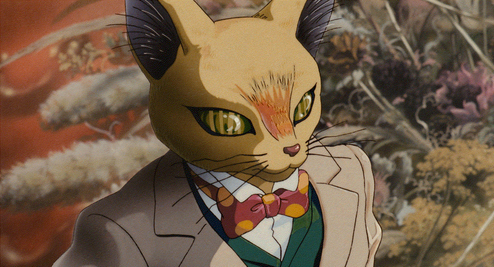
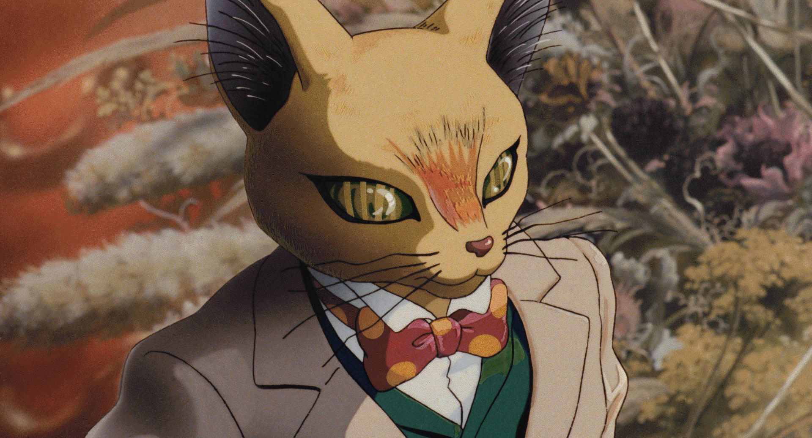

# ditherings
## Time
| 方式 | フォルダ（言語） | 8色 | 1.12.2 color |
| :--- | :--- | :--- | :--- |
| 近似 | python.2 | 3.7 Sec | 6.7 Sec |
| 近似 | cython.4 | 0.05 Sec | 1.14 Sec |
| 誤差拡散 | python  | 43 Sec | 56 Sec |
| 誤差拡散 | cython.1 | x | x |
| 誤差拡散 | cython.2 | 0.090 Sec | 1.23 Sec |
| 誤差拡散.改 | cython.3 | 0.064 Sec | 1.15 Sec |
| 誤差拡散.改 | java.1 | 0.27 Sec | 2.6 Sec |

## 画像
元画像

| 方式 | 8色 | 1.12.2 |
| :---: | :---: | :---: |
| 近似 |  |  |
| 誤差拡散 |  |  |
| 誤差拡散.改 |  |  |